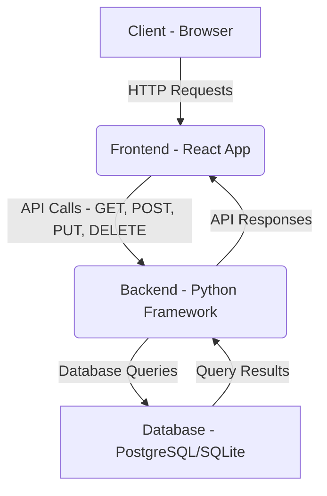

# Software Design Document: Habit-Builder Web Application

## 1. Project Overview

### 1.1. Introduction

The purpose of this document is to outline the design and architecture for a web application called "Habit-Builder." This application will serve as a personal tool for users to track, manage, and build positive habits. It will be a full-stack web application with a modern, responsive user interface.

### 1.2. Goals

- **Track Habits**: A user can create a new habit with a name and optional description. A user can mark a habit as "completed" for a given day. A user can view a list of all their active habits.
- **Visualize Progress**: The application displays a user's current streak for each habit. The application shows a calendar-based view of completed habits for the past month.
- **User Management**: Users can securely register with an email and password. Users can log in and log out of their account. User-specific data (habits) are only accessible by the authenticated user.
- **Responsive Design**: All pages and components are fully usable on screen sizes ranging from 320px (mobile) to 1920px (desktop) without horizontal scrolling.

### 1.3. Scope

The initial version will focus on the core features necessary for a Minimum Viable Product (MVP).

**In Scope for MVP:**

- User registration and authentication (login/logout).
- Creation of new habits.
- Viewing a list of all habits.
- Ability to "check off" a habit for the current day.
- Basic streak counter for each habit.
- Simple list-based view of habits.

**Future Iterations (Out of Scope for MVP):**

- Adding reminders or notifications.
- Social features (sharing progress, adding friends).
- Advanced analytics and reporting (e.g., historical completion rates, graphs).
- Support for different types of habits (e.g., habits with a specific value like "30 minutes of reading" or habits that require a specific number of repetitions).
- Habit archiving or deletion.
- Customizable habit colors.

## 2. Technology Stack

### 2.1. Frontend

- **Framework**: React with Vite
- **Styling**: Tailwind CSS with custom CSS for specific components
- **UI Components**: MUI (Material UI)
- **State Management**: React's built-in state management tools (`useState`, `useContext`) for local component state. A custom context provider will be used for global state (e.g., user authentication status)

### 2.2. Backend

- **Framework**: Django
- **Database**:  For development, use the default SQLite. For production, the plan is to migrate to PostgreSQL
- **Authentication**: Django's built-in user model for authentication. Token-based authentication for the API will be handled with a package like `djangorestframework-simplejwt`
- **APIs**: Django REST Framework will be used to build the RESTful API endpoints

## 3. Architecture

The application will follow a client-server architecture. The frontend will be a single-page application (SPA) built with React. It will communicate with the backend via REST API calls over HTTP.

### High-Level Data Flow -- "Checking Off" a Habit:

1. **User Action:** The user clicks a "complete" button next to a habit on the React frontend.
2. **API Call:** The React frontend makes a `POST` request to an API endpoint like `/api/habits/123/complete/` with a user's authentication token in the header.
3. **Backend Processing:**
    - The Django REST Framework view receives the request.
    - The view validates the authentication token and verifies that the user owns the habit with `id=123`.
    - The view checks if the habit has already been completed for the current day.
    - A new entry is created in the `habit_completions` table (see Data Model expansion below) for the current date and time.
4. **Database Update:** The Django model layer saves the new `HabitCompletion` object to the database.
5. **Response:** The backend returns a JSON response indicating success (e.g., `{"success": true, "streak_count": 5}`).
6. **Frontend Update:** The React frontend receives the success response and updates the UI, changing the button state and incrementing the streak count display.

## 4. Data Model

### 4.1. `users` Table

- `id` - Primary Key, Unique Identifier (`UUID`)
- `username` - Unique, String, max length 150
- `email` - Unique, String, max length 254
- `password_hash` - String, required, max length 128
- `created_at` - Timestamp, auto-generated on creation

### 4.2. `habits` Table

- `id` - Primary Key, Unique Identifier (`UUID`)
- `user_id` - Foreign Key, links to `users.id`
- `name` - String, max length 255
- `description` - String, max length 500, optional
- `created_at` - Timestamp, auto-generated on creation
- `is_active`: Boolean, default to `True`

### 4.3 `habit_completions` Table

- `id` - Primary Key, Unique Identifier (`UUID`)
- `habit_id` - Foreign Key, links to `habits.id`
- `completed_at` - Timestamp, auto-generated on creation
- `created_at` - Timestamp, auto-generated on creation

## 5. Development Strategy

### 5.1. Initial Setup

- Create a new React project with Vite.
- Create a new Django project and configure `django-rest-framework`.
- Set up a Git repository for both the frontend and backend.
- Create a simple `README.md` file with setup and run instructions.

### 5.2. Milestones

- **Milestone 1: User Authentication**
    - Create `User` model and authentication endpoints (registration, login).
    - Implement JWT token generation and authentication middleware.
    - Create a user registration form on the React frontend.
    - Create a login form on the React frontend.
    - Manage user state in the frontend after a successful login.
- **Milestone 2: Habit CRUD**
    - Create `Habit` and `HabitCompletion` models.
    - Create API endpoints for creating, reading, updating, and deleting habits.
    - Create a form on the React frontend to create new habits.
    - Display a list of habits retrieved from the API.
- **Milestone 3: Habit Tracking & Visualization**
    - Create an API endpoint for marking a habit as complete for the current day.
    - Implement the logic to calculate and display the current streak on the frontend.
    - Add a visual indicator (e.g., a checkbox or a different color) for completed habits on the list.
- **Milestone 4: Polish & Refinement**
    - Implement a full responsive design using Tailwind CSS.
    - Add basic error handling and validation on both the frontend and backend.
    - Write a basic test suite for the backend API endpoints.